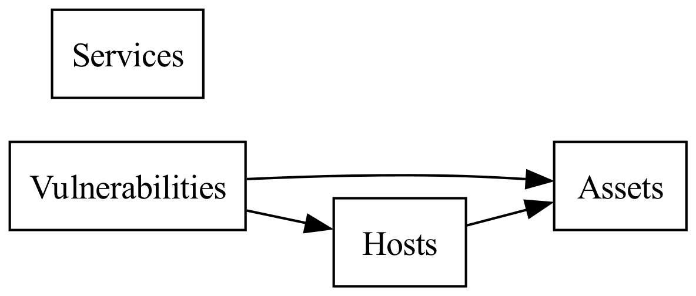

# Edgescan API client

This is a Python client for the Edgescan API.

## Features

- Lookup, list, count, and export metadata related to assets, hosts, vulnerabilities, and services.
- Command line interface provides output in JSONL format for easy parsing.

## Notes

The following relationships exist between assets, hosts, vulnerabilities, and services:

- Hosts are mapped to one or more assets using "location specifiers" (i.e. IP addresses, hostnames, CIDR ranges, etc.)
- Vulnerabilities are mapped to individual hosts and assets (i.e. each occurrence of a vulnerability on a host is a separate record)



## Usage

### Command line interface

#### Counting data

To count all assets:

```bash
poetry run edgescan count assets
```

To count all hosts:

```bash
poetry run edgescan count hosts
```

To count all vulnerabilities:

```bash
poetry run edgescan count vulnerabilities
```

To count all services:

```bash
poetry run edgescan count services
```

#### Listing data

To list all assets:

```bash
poetry run edgescan list assets | jq
```

To list all hosts:

```bash 
poetry run edgescan list hosts | jq
```

To list all vulnerabilities:

```bash
poetry run edgescan list vulnerabilities | jq
```

To list all services:

```bash
poetry run edgescan list services | jq
```

#### Exporting data

To export all assets to a file named `data/assets.jsonl`

```bash
poetry run edgescan export assets data/assets.jsonl
```

To export all hosts to a file named `data/hosts.jsonl`

```bash
poetry run edgescan export hosts data/hosts.jsonl
```

To export all vulnerabilities to a file named `data/vulnerabilities.jsonl`

```bash
poetry run edgescan export vulnerabilities data/vulnerabilities.jsonl
```

To export all services to a file named `data/services.jsonl`

```bash
poetry run edgescan export services data/services.jsonl
```

To export all assets, hosts, vulnerabilities, services to a directory named `data/`:

```bash
poetry run edgescan export all data/
```
